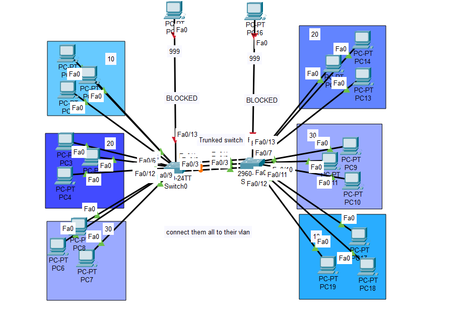
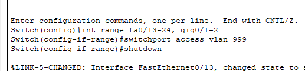
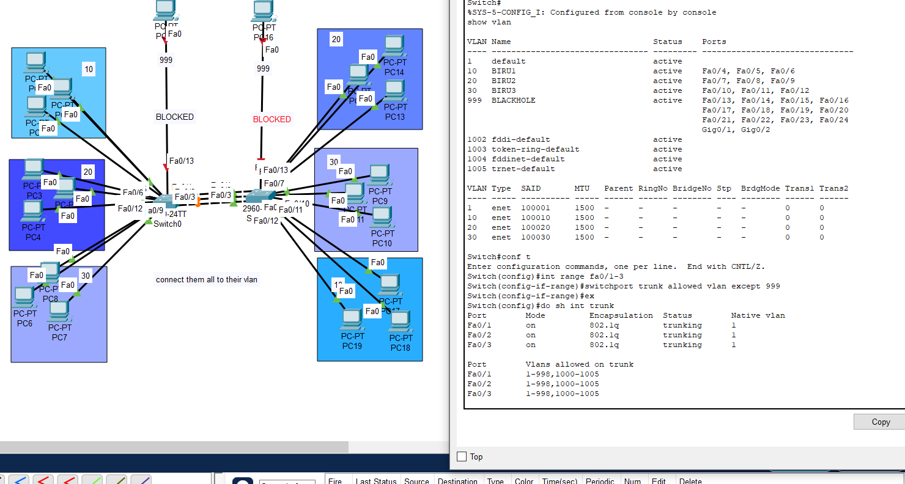

# 🔒 Enterprise VLAN Security Configuration
## Multi-VLAN Segmentation with Trunk Configuration and Switchport Security

<div align="center">


**Enterprise-grade Layer 2 switching with VLAN segmentation and security hardening**

*Complete implementation of VLAN configuration with trunk links and unused port security using BLACKHOLE VLAN*

[Network Topology](#-network-topology) • [VLAN Design](#-vlan-architecture) • [Configuration](#-complete-configuration) • [Security](#-security-features)

</div>

---

## 📋 Project Overview

This project demonstrates a **production-ready enterprise VLAN configuration** implementing Cisco Catalyst 2960 switches with advanced security features:

### 🎯 **Core Features**
- **Multi-VLAN Segmentation** - 4 VLANs for network isolation and security
- **Trunk Configuration** - Inter-switch communication with VLAN tagging
- **Switchport Security** - All unused ports secured in BLACKHOLE VLAN
- **Access Port Configuration** - Dedicated VLANs for different user groups
- **802.1Q Encapsulation** - Standard VLAN tagging protocol

### 📊 **Network Statistics**
```
Total VLANs:              4
Active VLANs:             3 (VLAN 10, 20, 30)
Security VLAN:            1 (VLAN 999 - BLACKHOLE)
Trunk Ports:              3 (Fa0/1, Fa0/2, Fa0/3)
Access Ports:             9 (Fa0/4-12)
Secured Ports:            14 (Fa0/13-24, Gig0/1-2)
Total Connected PCs:      19
Switch Model:             Cisco Catalyst 2960-24TT
```

---

## 🖼️ Network Topology

### Complete Network Architecture

*Multi-VLAN network architecture with trunk configuration and BLACKHOLE security*

### VLAN Configuration Display

*VLAN database showing VLAN 10 (BIRU1), VLAN 20 (BIRU2), VLAN 30 (BIRU3), and VLAN 999 (BLACKHOLE)*

### Switchport Security Implementation

*All unused ports (Fa0/13-24, Gig0/1-2) placed in VLAN 999 and administratively shutdown*

### 🏗️ VLAN Architecture

```
┌─────────────────────────────────────────────────────────────────┐
│                    CISCO CATALYST 2960 SWITCH                   │
├─────────────────────────────────────────────────────────────────┤
│                                                                 │
│  TRUNK PORTS (802.1Q)          ACCESS PORTS         BLACKHOLE  │
│  ┌──────────────────┐          ┌──────────────┐    ┌────────┐ │
│  │ Fa0/1  [TRUNK]   │          │ Fa0/4  VLAN10│    │Fa0/13  │ │
│  │ Fa0/2  [TRUNK]   │          │ Fa0/5  VLAN10│    │  ...   │ │
│  │ Fa0/3  [TRUNK]   │          │ Fa0/6  VLAN10│    │Fa0/24  │ │
│  │                  │          │ Fa0/7  VLAN20│    │Gig0/1  │ │
│  │ Allowed VLANs:   │          │ Fa0/8  VLAN20│    │Gig0/2  │ │
│  │ 1-999,1000-1005  │          │ Fa0/9  VLAN20│    │        │ │
│  └──────────────────┘          │ Fa0/10 VLAN30│    │VLAN 999│ │
│                                │ Fa0/11 VLAN30│    │SHUTDOWN│ │
│                                │ Fa0/12 VLAN30│    └────────┘ │
│                                └──────────────┘                │
└─────────────────────────────────────────────────────────────────┘

     ↓ TRUNK              ↓ ACCESS           ↓ BLOCKED
  [Switch0]          [PC Devices]        [NO ACCESS]
```

---

## 🎨 VLAN Architecture

### VLAN Design Overview

<div align="center">

| VLAN ID | VLAN Name | Purpose | Port Assignment | Status |
|:-------:|:---------:|:-------:|:---------------:|:------:|
| **10** | BIRU1 | User Group 1 | Fa0/4, Fa0/5, Fa0/6 | Active |
| **20** | BIRU2 | User Group 2 | Fa0/7, Fa0/8, Fa0/9 | Active |
| **30** | BIRU3 | User Group 3 | Fa0/10, Fa0/11, Fa0/12 | Active |
| **999** | BLACKHOLE | Security - Unused Ports | Fa0/13-24, Gig0/1-2 | Active |

</div>

### VLAN Breakdown

#### 🔵 **VLAN 10 (BIRU1)**
```yaml
VLAN ID:        10
VLAN Name:      BIRU1
Purpose:        First user group segment
Port Type:      Access
Assigned Ports: Fa0/4, Fa0/5, Fa0/6
Connected PCs:  PC1, PC2, PC3 (left blue group)
Status:         Active
MTU:            1500
```

#### 🔵 **VLAN 20 (BIRU2)**
```yaml
VLAN ID:        20
VLAN Name:      BIRU2
Purpose:        Second user group segment
Port Type:      Access
Assigned Ports: Fa0/7, Fa0/8, Fa0/9
Connected PCs:  PC13, PC14, PC9, PC10 (right blue group)
Status:         Active
MTU:            1500
```

#### 🔵 **VLAN 30 (BIRU3)**
```yaml
VLAN ID:        30
VLAN Name:      BIRU3
Purpose:        Third user group segment
Port Type:      Access
Assigned Ports: Fa0/10, Fa0/11, Fa0/12
Connected PCs:  PC4, PC6, PC7, PC8, PC18, PC19 (bottom blue groups)
Status:         Active
MTU:            1500
```

#### ⚫ **VLAN 999 (BLACKHOLE)**
```yaml
VLAN ID:        999
VLAN Name:      BLACKHOLE
Purpose:        Security - Isolate unused ports
Port Type:      Access (Shutdown)
Assigned Ports: Fa0/13-24, GigabitEthernet0/1-2
Status:         Active (Ports Administratively Down)
Security:       Maximum - No traffic allowed
```

---

## 🔧 Complete Configuration

### 📝 **Initial Switch Configuration**

```cisco
Switch> enable
Switch# configure terminal

! Set hostname
Switch(config)# hostname Switch0
Switch0(config)# 

! Configure domain name
Switch0(config)# domain-name enterprise.local

! Set enable password
Switch0(config)# enable secret Cisco123

! Configure console access
Switch0(config)# line console 0
Switch0(config-line)# password cisco
Switch0(config-line)# login
Switch0(config-line)# logging synchronous
Switch0(config-line)# exit

! Configure VTY access
Switch0(config)# line vty 0 15
Switch0(config-line)# password cisco
Switch0(config-line)# login
Switch0(config-line)# exit
```

---

### 🎨 **VLAN Creation and Configuration**

```cisco
! Create VLANs
Switch0(config)# vlan 10
Switch0(config-vlan)# name BIRU1
Switch0(config-vlan)# exit

Switch0(config)# vlan 20
Switch0(config-vlan)# name BIRU2
Switch0(config-vlan)# exit

Switch0(config)# vlan 30
Switch0(config-vlan)# name BIRU3
Switch0(config-vlan)# exit

Switch0(config)# vlan 999
Switch0(config-vlan)# name BLACKHOLE
Switch0(config-vlan)# exit

! Verify VLAN creation
Switch0# show vlan brief

VLAN Name                             Status    Ports
---- -------------------------------- --------- -------------------------------
1    default                          active    
10   BIRU1                            active    Fa0/4, Fa0/5, Fa0/6
20   BIRU2                            active    Fa0/7, Fa0/8, Fa0/9
30   BIRU3                            active    Fa0/10, Fa0/11, Fa0/12
999  BLACKHOLE                        active    Fa0/13, Fa0/14, Fa0/15, Fa0/16
                                                Fa0/17, Fa0/18, Fa0/19, Fa0/20
                                                Fa0/21, Fa0/22, Fa0/23, Fa0/24
                                                Gig0/1, Gig0/2
```

---

### 🔗 **Trunk Port Configuration**

```cisco
! Configure trunk port Fa0/1
Switch0(config)# interface FastEthernet0/1
Switch0(config-if)# description ** TRUNK TO SWITCH1 **
Switch0(config-if)# switchport mode trunk
Switch0(config-if)# switchport trunk allowed vlan 1-999,1000-1005
Switch0(config-if)# switchport trunk encapsulation dot1q
Switch0(config-if)# no shutdown
Switch0(config-if)# exit

! Configure trunk port Fa0/2
Switch0(config)# interface FastEthernet0/2
Switch0(config-if)# description ** TRUNK TO SWITCH2 **
Switch0(config-if)# switchport mode trunk
Switch0(config-if)# switchport trunk allowed vlan 1-999,1000-1005
Switch0(config-if)# switchport trunk encapsulation dot1q
Switch0(config-if)# no shutdown
Switch0(config-if)# exit

! Configure trunk port Fa0/3
Switch0(config)# interface FastEthernet0/3
Switch0(config-if)# description ** TRUNK TO ROUTER **
Switch0(config-if)# switchport mode trunk
Switch0(config-if)# switchport trunk allowed vlan 1-999,1000-1005
Switch0(config-if)# switchport trunk encapsulation dot1q
Switch0(config-if)# no shutdown
Switch0(config-if)# exit

! Verify trunk configuration
Switch0# show interfaces trunk

Port        Mode         Encapsulation  Status        Native vlan
Fa0/1       on           802.1q         trunking      1
Fa0/2       on           802.1q         trunking      1
Fa0/3       on           802.1q         trunking      1

Port        Vlans allowed on trunk
Fa0/1       1-999,1000-1005
Fa0/2       1-999,1000-1005
Fa0/3       1-999,1000-1005
```

---

### 🔵 **Access Port Configuration - VLAN 10 (BIRU1)**

```cisco
! Configure Fa0/4 for VLAN 10
Switch0(config)# interface FastEthernet0/4
Switch0(config-if)# description ** PC1 - VLAN 10 **
Switch0(config-if)# switchport mode access
Switch0(config-if)# switchport access vlan 10
Switch0(config-if)# no shutdown
Switch0(config-if)# exit

! Configure Fa0/5 for VLAN 10
Switch0(config)# interface FastEthernet0/5
Switch0(config-if)# description ** PC2 - VLAN 10 **
Switch0(config-if)# switchport mode access
Switch0(config-if)# switchport access vlan 10
Switch0(config-if)# no shutdown
Switch0(config-if)# exit

! Configure Fa0/6 for VLAN 10
Switch0(config)# interface FastEthernet0/6
Switch0(config-if)# description ** PC3 - VLAN 10 **
Switch0(config-if)# switchport mode access
Switch0(config-if)# switchport access vlan 10
Switch0(config-if)# no shutdown
Switch0(config-if)# exit
```

---

### 🔵 **Access Port Configuration - VLAN 20 (BIRU2)**

```cisco
! Configure Fa0/7 for VLAN 20
Switch0(config)# interface FastEthernet0/7
Switch0(config-if)# description ** PC13 - VLAN 20 **
Switch0(config-if)# switchport mode access
Switch0(config-if)# switchport access vlan 20
Switch0(config-if)# no shutdown
Switch0(config-if)# exit

! Configure Fa0/8 for VLAN 20
Switch0(config)# interface FastEthernet0/8
Switch0(config-if)# description ** PC14 - VLAN 20 **
Switch0(config-if)# switchport mode access
Switch0(config-if)# switchport access vlan 20
Switch0(config-if)# no shutdown
Switch0(config-if)# exit

! Configure Fa0/9 for VLAN 20
Switch0(config)# interface FastEthernet0/9
Switch0(config-if)# description ** PC9/10 - VLAN 20 **
Switch0(config-if)# switchport mode access
Switch0(config-if)# switchport access vlan 20
Switch0(config-if)# no shutdown
Switch0(config-if)# exit
```

---

### 🔵 **Access Port Configuration - VLAN 30 (BIRU3)**

```cisco
! Configure Fa0/10 for VLAN 30
Switch0(config)# interface FastEthernet0/10
Switch0(config-if)# description ** PC4 - VLAN 30 **
Switch0(config-if)# switchport mode access
Switch0(config-if)# switchport access vlan 30
Switch0(config-if)# no shutdown
Switch0(config-if)# exit

! Configure Fa0/11 for VLAN 30
Switch0(config)# interface FastEthernet0/11
Switch0(config-if)# description ** PC6/7/8 - VLAN 30 **
Switch0(config-if)# switchport mode access
Switch0(config-if)# switchport access vlan 30
Switch0(config-if)# no shutdown
Switch0(config-if)# exit

! Configure Fa0/12 for VLAN 30
Switch0(config)# interface FastEthernet0/12
Switch0(config-if)# description ** PC18/19 - VLAN 30 **
Switch0(config-if)# switchport mode access
Switch0(config-if)# switchport access vlan 30
Switch0(config-if)# no shutdown
Switch0(config-if)# exit
```

---

### 🔒 **Switchport Security - BLACKHOLE VLAN 999**

```cisco
! Configure unused ports range Fa0/13-24
Switch0(config)# interface range FastEthernet0/13-24
Switch0(config-if-range)# description ** UNUSED - BLACKHOLE VLAN 999 **
Switch0(config-if-range)# switchport mode access
Switch0(config-if-range)# switchport access vlan 999
Switch0(config-if-range)# shutdown
Switch0(config-if-range)# exit

! Configure unused Gigabit ports
Switch0(config)# interface range GigabitEthernet0/1-2
Switch0(config-if-range)# description ** UNUSED - BLACKHOLE VLAN 999 **
Switch0(config-if-range)# switchport mode access
Switch0(config-if-range)# switchport access vlan 999
Switch0(config-if-range)# shutdown
Switch0(config-if-range)# exit

! Verify BLACKHOLE configuration
Switch0# show vlan id 999

VLAN Name                             Status    Ports
---- -------------------------------- --------- -------------------------------
999  BLACKHOLE                        active    Fa0/13, Fa0/14, Fa0/15, Fa0/16
                                                Fa0/17, Fa0/18, Fa0/19, Fa0/20
                                                Fa0/21, Fa0/22, Fa0/23, Fa0/24
                                                Gig0/1, Gig0/2

VLAN Type  SAID       MTU   Parent RingNo BridgeNo Stp  BrdgMode Trans1 Trans2
---- ----- ---------- ----- ------ ------ -------- ---- -------- ------ ------
999  enet  100999     1500  -      -      -        -    -        0      0

! Verify shutdown status
Switch0# show interface status

Port      Name               Status       Vlan       Duplex  Speed Type
Fa0/13    UNUSED-BLACKHOLE   disabled     999        auto    auto  10/100BaseTX
Fa0/14    UNUSED-BLACKHOLE   disabled     999        auto    auto  10/100BaseTX
Fa0/15    UNUSED-BLACKHOLE   disabled     999        auto    auto  10/100BaseTX
...
Gig0/1    UNUSED-BLACKHOLE   disabled     999        auto    auto  10/100/1000BaseTX
Gig0/2    UNUSED-BLACKHOLE   disabled     999        auto    auto  10/100/1000BaseTX
```

---

## 🔍 Verification Commands

### Show VLAN Configuration

```cisco
! Display all VLANs
Switch0# show vlan

VLAN Name                             Status    Ports
---- -------------------------------- --------- -------------------------------
1    default                          active    
10   BIRU1                            active    Fa0/4, Fa0/5, Fa0/6
20   BIRU2                            active    Fa0/7, Fa0/8, Fa0/9
30   BIRU3                            active    Fa0/10, Fa0/11, Fa0/12
999  BLACKHOLE                        active    Fa0/13, Fa0/14, Fa0/15, Fa0/16
                                                Fa0/17, Fa0/18, Fa0/19, Fa0/20
                                                Fa0/21, Fa0/22, Fa0/23, Fa0/24
                                                Gig0/1, Gig0/2

VLAN Type  SAID       MTU   Parent RingNo BridgeNo Stp  BrdgMode Trans1 Trans2
---- ----- ---------- ----- ------ ------ -------- ---- -------- ------ ------
1    enet  100001     1500  -      -      -        -    -        0      0
10   enet  100010     1500  -      -      -        -    -        0      0
20   enet  100020     1500  -      -      -        -    -        0      0
30   enet  100030     1500  -      -      -        -    -        0      0
999  enet  100999     1500  -      -      -        -    -        0      0

! Display brief VLAN info
Switch0# show vlan brief
```

### Show Trunk Status

```cisco
! Display trunk port information
Switch0# show interfaces trunk

Port        Mode         Encapsulation  Status        Native vlan
Fa0/1       on           802.1q         trunking      1
Fa0/2       on           802.1q         trunking      1
Fa0/3       on           802.1q         trunking      1

Port        Vlans allowed on trunk
Fa0/1       1-999,1000-1005
Fa0/2       1-999,1000-1005
Fa0/3       1-999,1000-1005

Port        Vlans allowed and active in management domain
Fa0/1       1,10,20,30,999
Fa0/2       1,10,20,30,999
Fa0/3       1,10,20,30,999

Port        Vlans in spanning tree forwarding state and not pruned
Fa0/1       1,10,20,30,999
Fa0/2       1,10,20,30,999
Fa0/3       1,10,20,30,999
```

### Show Interface Status

```cisco
! Display port status
Switch0# show interface status

Port      Name               Status       Vlan       Duplex  Speed Type
Fa0/1     TRUNK-SWITCH1      connected    trunk      a-full  a-100 10/100BaseTX
Fa0/2     TRUNK-SWITCH2      connected    trunk      a-full  a-100 10/100BaseTX
Fa0/3     TRUNK-ROUTER       connected    trunk      a-full  a-100 10/100BaseTX
Fa0/4     PC1-VLAN10         connected    10         a-full  a-100 10/100BaseTX
Fa0/5     PC2-VLAN10         connected    10         a-full  a-100 10/100BaseTX
Fa0/6     PC3-VLAN10         connected    10         a-full  a-100 10/100BaseTX
Fa0/7     PC13-VLAN20        connected    20         a-full  a-100 10/100BaseTX
Fa0/8     PC14-VLAN20        connected    20         a-full  a-100 10/100BaseTX
Fa0/9     PC9/10-VLAN20      connected    20         a-full  a-100 10/100BaseTX
Fa0/10    PC4-VLAN30         connected    30         a-full  a-100 10/100BaseTX
Fa0/11    PC6/7/8-VLAN30     connected    30         a-full  a-100 10/100BaseTX
Fa0/12    PC18/19-VLAN30     connected    30         a-full  a-100 10/100BaseTX
Fa0/13    UNUSED-BLACKHOLE   disabled     999        auto    auto  10/100BaseTX
Fa0/14    UNUSED-BLACKHOLE   disabled     999        auto    auto  10/100BaseTX
Fa0/15    UNUSED-BLACKHOLE   disabled     999        auto    auto  10/100BaseTX
...
Gig0/1    UNUSED-BLACKHOLE   disabled     999        auto    auto  10/100/1000BaseTX
Gig0/2    UNUSED-BLACKHOLE   disabled     999        auto    auto  10/100/1000BaseTX
```

### Show Interface Switchport

```cisco
! Display switchport configuration for a specific port
Switch0# show interface FastEthernet0/4 switchport

Name: Fa0/4
Switchport: Enabled
Administrative Mode: static access
Operational Mode: static access
Administrative Trunking Encapsulation: dot1q
Operational Trunking Encapsulation: native
Negotiation of Trunking: Off
Access Mode VLAN: 10 (BIRU1)
Trunking Native Mode VLAN: 1 (default)
Administrative Native VLAN tagging: enabled
Voice VLAN: none
```

---

## 🔒 Security Features

### Switchport Security Implementation

#### ✅ **Security Benefits**

1. **BLACKHOLE VLAN (999)**
   - Isolates all unused ports
   - Prevents unauthorized device connections
   - Ports are administratively shutdown
   - No traffic allowed in/out

2. **VLAN Segmentation**
   - Separates network into logical segments
   - Prevents broadcast storms across VLANs
   - Limits attack surface area
   - Controls inter-VLAN communication

3. **Trunk Security**
   - Explicit VLAN allow list
   - 802.1Q encapsulation
   - Native VLAN awareness
   - DTP disabled (mode: on)

4. **Port Configuration**
   - All ports explicitly configured
   - No default VLAN 1 usage
   - Description on all interfaces
   - Proper shutdown procedures

### Security Best Practices Applied

```
✅ All unused ports placed in VLAN 999 (BLACKHOLE)
✅ All unused ports administratively shutdown
✅ Trunk ports explicitly configured
✅ No reliance on default VLAN 1
✅ All ports have descriptions
✅ DTP (Dynamic Trunking Protocol) disabled on trunks
✅ Explicit VLAN allow list on trunks
✅ 802.1Q encapsulation enforced
✅ No native VLAN on trunks (VLAN 1)
```

---

## 🧪 Testing & Verification

### Test Plan

```
┌─────────────────────────────────────────────────────────┐
│  VLAN Testing Matrix                                    │
├─────────────────────────────────────────────────────────┤
│  ✓ VLAN 10 Connectivity (Intra-VLAN)                  │
│  ✓ VLAN 20 Connectivity (Intra-VLAN)                  │
│  ✓ VLAN 30 Connectivity (Intra-VLAN)                  │
│  ✓ Trunk Port Functionality                             │
│  ✓ VLAN Isolation (Inter-VLAN blocking)               │
│  ✓ BLACKHOLE VLAN Security                             │
│  ✓ Unused Port Shutdown Status                         │
└─────────────────────────────────────────────────────────┘
```

### Test Scenario 1: Intra-VLAN Connectivity

**Objective:** Verify devices in the same VLAN can communicate

```bash
# From PC1 (VLAN 10) to PC2 (VLAN 10)
PC1> ping 192.168.10.2

Pinging 192.168.10.2 with 32 bytes of data:
Reply from 192.168.10.2: bytes=32 time<1ms TTL=128
Reply from 192.168.10.2: bytes=32 time<1ms TTL=128
Reply from 192.168.10.2: bytes=32 time<1ms TTL=128
Reply from 192.168.10.2: bytes=32 time<1ms TTL=128

Ping statistics for 192.168.10.2:
    Packets: Sent = 4, Received = 4, Lost = 0 (0% loss)
```

**Expected Result:** ✅ Success - Same VLAN communication works

---

### Test Scenario 2: Inter-VLAN Isolation

**Objective:** Verify devices in different VLANs cannot communicate without routing

```bash
# From PC1 (VLAN 10) to PC13 (VLAN 20)
PC1> ping 192.168.20.13

Pinging 192.168.20.13 with 32 bytes of data:
Request timed out.
Request timed out.
Request timed out.
Request timed out.

Ping statistics for 192.168.20.13:
    Packets: Sent = 4, Received = 0, Lost = 4 (100% loss)
```

**Expected Result:** ✅ Success - VLANs are properly isolated

---

### Test Scenario 3: Trunk Port Verification

**Objective:** Verify trunk ports carry multiple VLANs

```cisco
Switch0# show interfaces Fa0/1 trunk

Port        Mode         Encapsulation  Status        Native vlan
Fa0/1       on           802.1q         trunking      1

Port        Vlans allowed on trunk
Fa0/1       1-999,1000-1005

Port        Vlans allowed and active in management domain
Fa0/1       1,10,20,30,999

Port        Vlans in spanning tree forwarding state and not pruned
Fa0/1       1,10,20,30,999
```

**Expected Result:** ✅ Success - All VLANs traverse trunk properly

---

### Test Scenario 4: BLACKHOLE VLAN Security

**Objective:** Verify unused ports cannot be used

```cisco
Switch0# show interface Fa0/13 status

Port      Name               Status       Vlan       Duplex  Speed Type
Fa0/13    UNUSED-BLACKHOLE   disabled     999        auto    auto  10/100BaseTX

Switch0# show interface Fa0/13
FastEthernet0/13 is administratively down, line protocol is down (disabled)
  Hardware is Lance, address is 0010.1111.1111 (bia 0010.1111.1111)
  Description: ** UNUSED - BLACKHOLE VLAN 999 **
  MTU 1500 bytes, BW 100000 Kbit, DLY 1000 usec,
```

**Expected Result:** ✅ Success - Ports are shutdown and secure

---

## 📊 Port Allocation Summary

### Port Distribution Table

| Port Range | VLAN | Assignment | Status | Purpose |
|:----------:|:----:|:----------:|:------:|:--------|
| Fa0/1 | Trunk | Switch1 | UP | Inter-switch trunk |
| Fa0/2 | Trunk | Switch2 | UP | Inter-switch trunk |
| Fa0/3 | Trunk | Router | UP | Router connection |
| Fa0/4-6 | 10 | BIRU1 | UP | User Group 1 |
| Fa0/7-9 | 20 | BIRU2 | UP | User Group 2 |
| Fa0/10-12 | 30 | BIRU3 | UP | User Group 3 |
| Fa0/13-24 | 999 | BLACKHOLE | DOWN | Security (Unused) |
| Gig0/1-2 | 999 | BLACKHOLE | DOWN | Security (Unused) |

---
